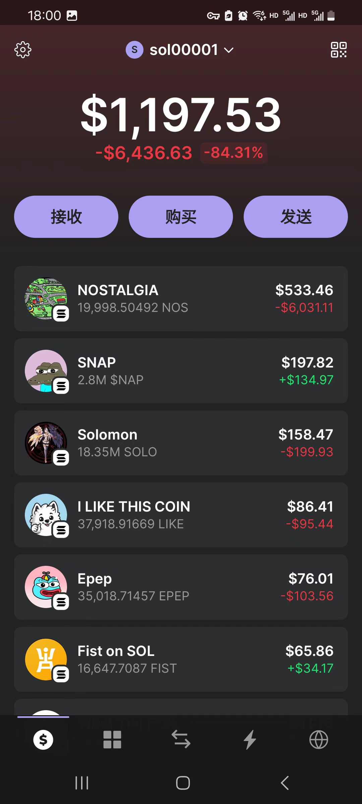
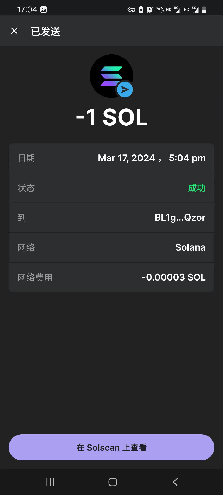
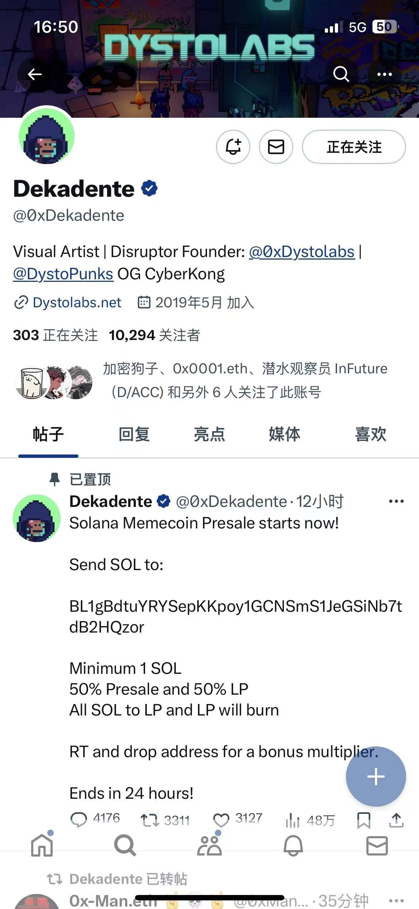

## 1.SODI捐赠了-5个sol

```text
Sodi is the first royalty inscription protocol on
我们已经与@SuperExet达成合作，将于世界标准时间3月19日8：00—3月20日00：00在其平台上推出#IEO。我们希望#SODI是一个持续的、有意义的生态系统，所以我们重新分配了$SODI的经济模式。新的计划如下：

10%IEO，40%空投给盒子持有者和SOL捐赠者，10%以活动空投的形式陆续分发给社区，剩下的40%直接销毁，放空代币总量至1.26亿。

在IEO之后，我们将正式开始$SODI空投，并同步盒子和公牛NFT的分配。积分持有者可以获得第一轮$SODI空投。空投完成后，积分系统将正式关闭。请检查您的$SODI，盒子和NFT。
```

Solana + Ordi = 的概念，我认为SOL已经崛起，炒作一波还是可以赚钱的

https://www.sodi.ai/inscription

https://www.sodi.ai/inscription

## 2.NAP和Nos like直接亏麻



## 3.smol

https://smolerc.com/
https://twitter.com/0xDekadente

```smol
Smol 有关$smole启动的详细信息：

明天晚上，我们不会透露确切的时间，以避免机器人...... UTC 时区

空投将在 LP 之前而不是之后进行。

4200亿$smole ：50%预售，50%给LP

非常小的百分比将分配给乘数（那些分享钱包并转发发布推文的人）

所有未达到 1 SOL 或在截止时间后发送的资金将被退还。

我们正在煮一些东西！请继续关注即将发生的事情，它很大
```



